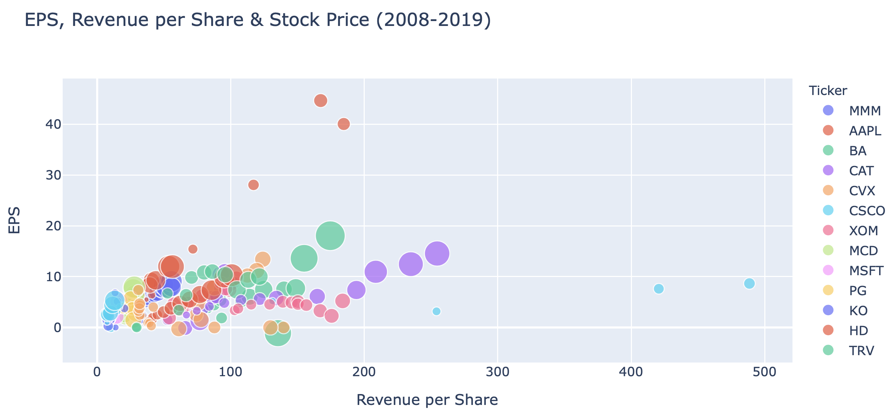
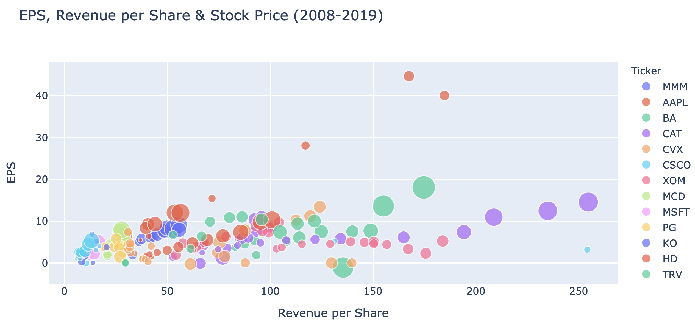
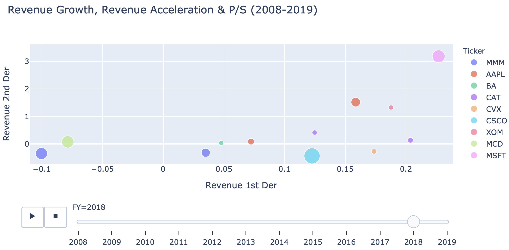
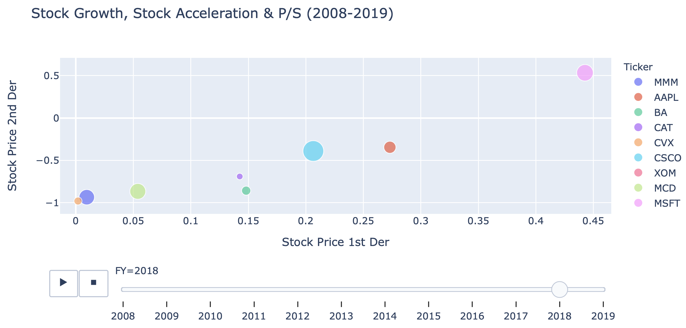
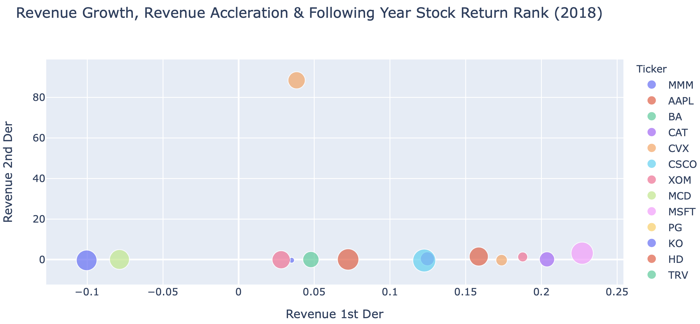
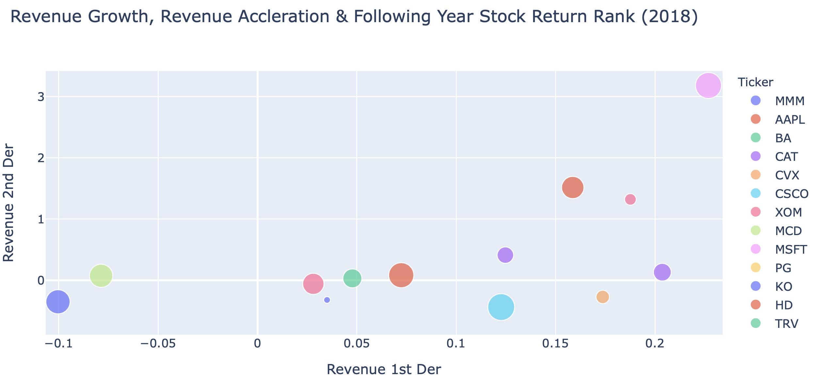
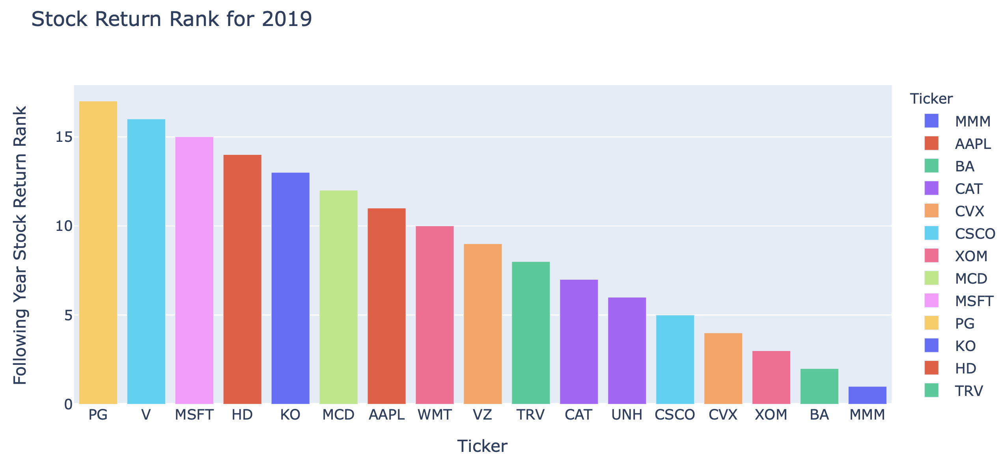

# ValuationVisualization

## Background

Analyze how first and second derivatives of key fundamental metrics correlate with stock valuations and do these relationships correlate with stock performance?

Said another way, are current valuations justified with the growth and acceleration?

### The questions we set out to answer:
* Does revenue growth (revenue 1st derivative) correlate with the highest stock valuations (P/S multiple)?

* Taking this a step further, does revenue acceleration (revenue 2nd derivative) correlate with the highest stock valuations (P/S multiple)?

* Is there a relationship between revenue 1st and 2nd derivatives with future stock performance?

The same question applies to earnings/earnings growth, acceleration, and the Price to Earnings (P/E) multiple. Looking at revenue is useful when analyzing companies with negative earnings. Revenue is always positive, whereas earnings are sometimes negative, particularly for younger, high-growth companies.

We set out to look at the previous year’s financial data for each stock and determine if it was predictive of the following year’s stock returns.

e.g. Are MSFT’s FY 2018 revenue growth, revenue acceleration, and P/S multiple predictive for MSFT’s FY 2019 stock performance?

---

## Data engineering

We used the FinancialModelingPrep.com API to pull Income Statement, Financial Ratio, and Enterprise Value data for the Dow 30 stocks since 2008. As part of the data cleaning process we discovered data gaps and/or quality issues and completed our analysis on a sample of 17 Dow stocks.

We created empty lists to populate a dictionary of lists that would become our DataFrame. Using nested for loops, we iterated by ticker and year to fill the empty lists with the relevant fundamental api data: date, ticker symbol, stock price, revenue, EPS, P/E, P/S, shares outstanding, and market cap. To avoid errors for incomplete data, we used the “try” and “except” statements for exception handling. To speed ongoing analysis we exported the resulting DataFrame to a csv file. 

Next we wrote functions to calculate the first and second derivatives of earnings and revenue/sales. The for loops within the functions we created allowed us to calculate first and second derivatives across multiple tickers and multiple years. Additionally, when the first derivative value changes sign (from positive to negative or vice versa) from one period to the next, the resulting second derivative is nonsensical for financial analysis, so we replaced nonsensical second derivative values with nulls. We created a fiscal year column to compensate for differing reporting dates. Our analysis is therefore based on fiscal years. The last step to modify our DataFrame was to align the next year’s return with the previous year’s financial metrics. From here we were able to start plotting our data!

---

## What we found

If we picked the stocks with highest yoy growth and acceleration, how did we do?

For 2018, this was Microsoft....

### Correlations

image here

## Conclusion

Can this help in predictive modeling?
Visualizing data for quick analysis vs. tables of data.
Set up for machine learning applications.