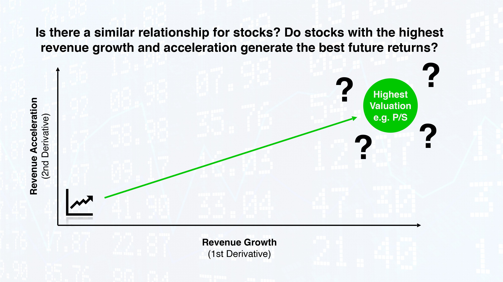

## Background

We set out to look at historical financial data through visualizations for the Dow 30 stocks to determine if it was potentially predictive of future stock returns.

To do this we analyzed how first and second derivatives of key fundamental metrics correlate with stock valuations and future stock performance.



### The question we set out to answer:

Are high stock valuations justified by revenue growth and acceleration, and does this correlate with stock performance?

The same question applies to earnings/earnings growth, acceleration, and the Price to Earnings (P/E) multiple. Looking at revenue is useful when analyzing companies with negative earnings. Revenue is always positive, whereas earnings are sometimes negative, particularly for younger, high-growth companies.

```
Example: Are MSFT’s FY 2018 revenue growth, revenue acceleration, and P/S multiple predictive for MSFT’s FY 2019 stock performance?
```
---

## Data engineering

We used the FinancialModelingPrep.com API to pull Income Statement, Financial Ratio, and Enterprise Value data for the Dow 30 stocks since 2008. As part of the data cleaning process we discovered data gaps and/or quality issues and completed our analysis on a sample of 17 Dow stocks.

We created empty lists to populate a dictionary of lists that would become our DataFrame. Using nested for loops, we iterated by ticker and year to fill the empty lists with the relevant fundamental api data: date, ticker symbol, stock price, revenue, EPS, P/E, P/S, shares outstanding, and market cap. To avoid errors for incomplete data, we used the “try” and “except” statements for exception handling. To speed ongoing analysis we exported the resulting DataFrame to a csv file. 

Next we wrote functions to calculate the first and second derivatives of earnings and revenue/sales. The for loops within the functions we created allowed us to calculate first and second derivatives across multiple tickers and multiple years. Additionally, when the first derivative value changes sign (from positive to negative or vice versa) from one period to the next, the resulting second derivative is nonsensical for financial analysis, so we replaced nonsensical second derivative values with nulls. We created a fiscal year column to compensate for differing reporting dates. Our analysis is therefore based on fiscal years. The last step to modify our DataFrame was to align the next year’s return with the previous year’s financial metrics. From here we were able to start plotting our data!

---

## What we found

Plotting our DataFrame we were able to visualize EPS, Revenue per Share, and Share Price for the period from 2008 to 2019.  


Changing our axes to represent Revenue Growth (Revenue 1st Derivative) and Revenue Acceleration (Revenue 2nd Derivative) we observed that companies with positive revenue acceleration had positive returns the following year 80% of the time. Adding a threshold greater than 1 for the 2nd derivitive increased probabilities that the folowing year's returns were positive. We believe this is a particularly attractive metric for risk averse investors.


This led us to hypothesizing the following relationships. Diving into single year snapshots we found strong confirmation.


Adding an interactive year slider we were able to adjust our focus to snapshots of each fiscal year. Changing our axes to represent Revenue Growth (Revenue 1st Derivative) and Revenue Acceleration (Revenue 2nd Derivative) and focusing on one year, we chose Microsoft to test our hypothesis. Microsoft is the most north-easterly stock in the upper right quandrant. This combination of relatively high revenue growth and acceleration also coincides with one of the largest price-to-sales multiples (bubble size). Next we wanted to see if this was at all indicative of the stock performance for the following fiscal year.


If we picked the stock with highest YoY growth and acceleration (i.e. MSFT), how did we do?

Since bubble size must represent positive numbers we created a Following Year Stock Return Rank. Changing the bubble size to represent the Following Year Stock Return Rank, we see that MSFT is one of the top performers for the following year. 


To better visualize this we plotted a bar chart of fiscal year 2019's ranked stock performance. MSFT was among the top 3 performing stocks, validating our hypothesis.


### Correlations

To take a deeper look at Microsoft we calculated a correlation matrix and saw a strong correlation (0.73) between Revenue Per Share and the Following Year Stock Return. 


## Final Thoughts

By visualizing our DataFrame we were able to quickly identify notable trends.

The first relationship we found was that irrespective of high P/S multiples, we observed that stocks with growing revenue and revenue acceleration had positive future year stock returns with high probability. Counter-intuitive to the common valuation approach to invest in underpriced stocks (or avoid overpriced stocks), when stocks had growing revenue and revenue acceleration this should be viewed as a strong momentum buy.

The second compelling relationship we identified was when stocks had both negative revenue growth and negative acceleration of revenue (decelerating decline in revenue) we observed these are potential turn around candidates. Stocks meeting this criteria often showed returns greater that 50% for the following year.

Ideally this analysis can be expanded upon to include a larger sample of stocks and over a longer timeframe. We would like to continue testing our hypotheses with the addition of machine learning applications in the future! 


